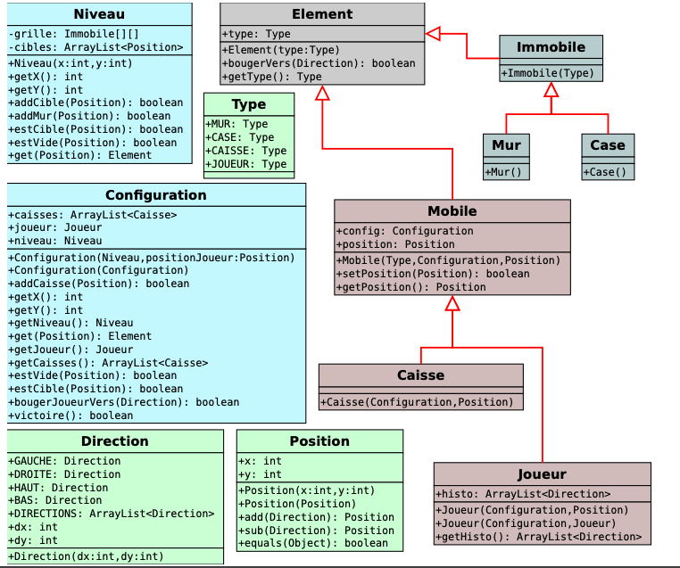

Sokoban.java contient la classe pour la visualisation graphique du jeu et du solveur.
Trois fichiers de niveaux sont fournis (source : http://www.sourcecode.se/sokoban/levels), n'oubliez pas de configurer si besoin le chemin d'acces par la variable statique PATH.
 
La méthode main charge un niveau à partir d'un fichier et d'un numéro de niveau. 
La méthode jouer permet de jouer une configuraton chargée. 
La méthode replay permet de rejouer une configuration à partir de l'historique des déplacements. 
La méthode résoudre permet de résoudre pas a pas un niveau en affichant chaque étape à partir d'un solveur respectant l'interface SolverInterface. 
Si vous avez bien respecté les conventions de nommages de l'énoncé, il ne devrait pas y avoir de conflits. 
 
	
 
